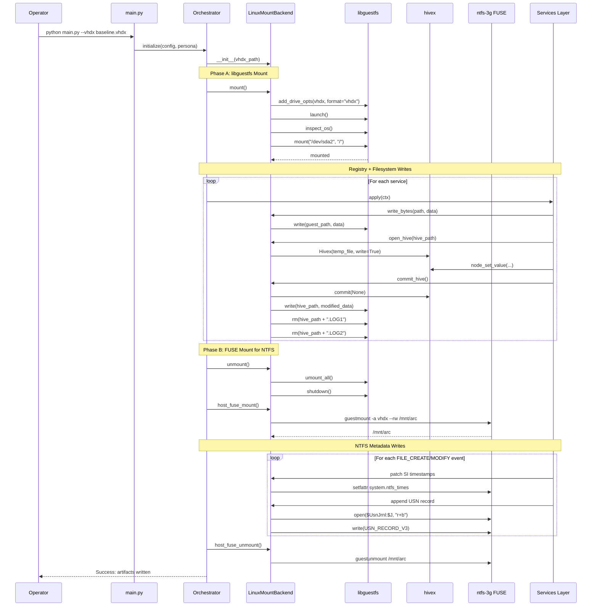

# Design Document: Linux Host Support for ARC

## Overview

This design document specifies the complete migration of ARC (Artifact Reality Composer) from Windows-only host support to Linux-only host support. ARC personalizes Windows 11 VM images (VHDX/VHD) to resist VM-detection heuristics by writing realistic artifacts across registry, filesystem, browser data, event logs, and NTFS metadata. The target VM remains Windows 11; only the host platform changes from Windows to Linux (Ubuntu 24.04+).

**Key Constraint**: The Windows 11 VM (VHDX target) is unchanged. ARC operates offline on a post-OOBE (Out-of-Box Experience) baseline VHDX that has completed at least one boot and clean shutdown.

## Main Algorithm/Workflow



## Architecture Components

### 1. LinuxMountBackend (`core/linux_mount.py`)

**Purpose**: Provides unified interface for VHDX access using libguestfs (Phase A) and ntfs-3g FUSE (Phase B).

**Key Responsibilities**:
- Mount/unmount VHDX images via libguestfs appliance
- Provide file I/O operations (read_bytes, write_bytes, mkdir_p, ls, rm)
- Manage hivex-based registry hive editing with automatic .LOG cleanup
- Expose FUSE mountpoint for NTFS metadata operations
- Handle NTFS attribute setting via xattr

**API Surface**:
```python
class LinuxMountBackend:
    def __init__(self, vhdx_path: Path) -> None
    def mount(self) -> None
    def unmount(self) -> None
    
    # File I/O (Phase A - libguestfs)
    def read_bytes(self, path: str) -> bytes
    def write_bytes(self, path: str, data: bytes) -> None
    def write_text(self, path: str, text: str, encoding: str = "utf-8") -> None
    def mkdir_p(self, path: str) -> None
    def exists(self, path: str) -> bool
    def rm(self, path: str) -> None
    def ls(self, path: str) -> List[str]
    
    # Timestamps (Phase A - basic)
    def utimens(self, path: str, atime: datetime, mtime: datetime) -> None
    
    # NTFS attributes (Phase A - via libguestfs xattr)
    def set_ntfs_attributes(self, path: str, *, hidden: bool, system: bool, archive: bool) -> None
    
    # Registry hive operations (Phase A - hivex)
    @contextmanager
    def open_hive(self, hive_guest_path: str) -> Generator[HivexHandle, None, None]
    
    # FUSE mount for NTFS metadata (Phase B)
    def host_fuse_mount(self) -> Path
    def host_fuse_unmount(self) -> None
```

**Critical Implementation Details**:

1. **Two-Phase Mount Strategy**:
   - Phase A (libguestfs): Registry + bulk filesystem writes
   - Phase B (FUSE): NTFS $STANDARD_INFORMATION timestamps + $UsnJrnl appends
   - **Cannot overlap**: Only one can hold the VHDX at a time

2. **Hive Log Cleanup (ADR-010)**:
   - After every hivex commit, delete `.LOG1` and `.LOG2`
   - Prevents Windows from replaying old transactions over ARC's writes
   - Pre-flight check: verify logs are writable before attempting hive write

3. **Error Handling**:
   - Graceful degradation: if hive log cleanup fails, log warning but continue
   - FUSE mount failures: provide clear diagnostics (check ntfs-3g version, permissions)

### 2. MountManager (`core/mount_manager.py`)

**Purpose**: Abstraction layer that services use for path resolution and NTFS operations.

**Changes from Windows Version**:
- Remove all Windows-specific path handling (drive letters, backslashes)
- Delegate NTFS operations to LinuxMountBackend when available
- Support both standalone mode (local directory) and backend mode (FUSE mount)

**API Surface**:
```python
class MountManager:
    def __init__(self, mount_root: str, backend: Optional[LinuxMountBackend] = None)
    
    @property
    def root(self) -> Path
    
    @property
    def backend(self) -> Optional[LinuxMountBackend]
    
    def resolve(self, relative_path: str = "") -> Path
    
    def set_ntfs_attributes(self, relative_path: str, *, hidden: bool, system: bool, archive: bool) -> None
    
    def utimens(self, relative_path: str, atime: datetime, mtime: datetime) -> None
```

**Key Behavior**:
- When `backend` is None: operates in standalone mode (testing/dry-run)
- When `backend` is provided: all NTFS operations delegate to backend
- Path resolution: converts Windows-style paths to POSIX for backend

### 3. Orchestrator Changes (`core/orchestrator.py`)

**Modifications Required**:

1. **Initialization**:
   - Accept `--vhdx-path` CLI argument
   - Create `LinuxMountBackend` instance if VHDX path provided
   - Pass backend to `MountManager` constructor

2. **Service Execution**:
   - Phase A: Run all services except NTFS services
   - Unmount libguestfs
   - Phase B: Mount FUSE, run NTFS services, unmount FUSE

3. **Cleanup**:
   - Ensure proper unmount in finally block
   - Handle SIGINT/SIGTERM gracefully

**Pseudocode**:
```python
def run(self):
    if self._vhdx_path:
        backend = LinuxMountBackend(self._vhdx_path)
        backend.mount()
        self._mount_manager = MountManager(str(self._vhdx_path), backend=backend)
    else:
        self._mount_manager = MountManager(self._config["mount_path"])
    
    try:
        # Phase A: Registry + Filesystem
        for service in self._phase_a_services:
            service.apply(self._ctx)
        
        if backend:
            backend.unmount()
            fuse_mount = backend.host_fuse_mount()
            
            # Phase B: NTFS metadata
            for service in self._ntfs_services:
                service.apply(self._ctx)
            
            backend.host_fuse_unmount()
    finally:
        if backend:
            backend.unmount()
```

### 4. Service Layer Changes

**No API Changes Required**: Services continue to use `MountManager` API. The delegation to `LinuxMountBackend` is transparent.

**Services Requiring Updates**:

1. **`services/filesystem/cross_writer.py`**:
   - Remove `pywin32` imports (`win32api`, `win32con`, `pywintypes`)
   - Replace `win32file.SetFileAttributes()` with `mount.set_ntfs_attributes()`
   - Replace `win32file.SetFileTime()` with `mount.utimens()`

2. **`services/registry/hive_writer.py`**:
   - Replace hand-rolled binary hive writes with `backend.open_hive()` context manager
   - Preserve `HiveOperation` abstraction for service compatibility
   - Delegate to hivex for actual writes

3. **`services/ntfs/` (NEW)**:
   - `mft_timestamp_patcher.py`: Use FUSE mount + `setfattr system.ntfs_times`
   - `usn_journal_writer.py`: Append USN_RECORD_V3 to `$Extend/$UsnJrnl:$J`
   - `logfile_writer.py`: Best-effort $LogFile stub (optional)

## Data Structures

### HivexHandle

```python
class HivexHandle:
    """Context manager for offline hive editing."""
    
    def __init__(self, backend: LinuxMountBackend, hive_guest_path: str)
    
    @property
    def h(self) -> hivex.Hivex
    
    def commit(self) -> None
    
    def _cleanup(self) -> None
```

**Lifecycle**:
1. `__enter__`: Pull hive from VHDX to temp file, open with hivex
2. Service performs node/value operations via `h` property
3. `__exit__`: Commit changes, write back to VHDX, delete .LOG1/.LOG2

### USN_RECORD_V3

```python
@dataclass
class UsnRecordV3:
    """NTFS Update Sequence Number record (version 3)."""
    
    record_length: int
    major_version: int = 3
    minor_version: int = 0
    file_reference_number: int
    parent_file_reference_number: int
    usn: int
    timestamp: int  # Windows FILETIME
    reason: int  # USN_REASON_* flags
    source_info: int
    security_id: int
    file_attributes: int
    file_name_length: int
    file_name_offset: int
    file_name: str
    
    def to_bytes(self) -> bytes:
        """Pack to binary format for $UsnJrnl:$J append."""
```

**USN Reason Flags** (from `winioctl.h`):
```python
USN_REASON_DATA_OVERWRITE = 0x00000001
USN_REASON_DATA_EXTEND = 0x00000002
USN_REASON_DATA_TRUNCATION = 0x00000004
USN_REASON_NAMED_DATA_OVERWRITE = 0x00000010
USN_REASON_NAMED_DATA_EXTEND = 0x00000020
USN_REASON_NAMED_DATA_TRUNCATION = 0x00000040
USN_REASON_FILE_CREATE = 0x00000100
USN_REASON_FILE_DELETE = 0x00000200
USN_REASON_EA_CHANGE = 0x00000400
USN_REASON_SECURITY_CHANGE = 0x00000800
USN_REASON_RENAME_OLD_NAME = 0x00001000
USN_REASON_RENAME_NEW_NAME = 0x00002000
USN_REASON_INDEXABLE_CHANGE = 0x00004000
USN_REASON_BASIC_INFO_CHANGE = 0x00008000
USN_REASON_HARD_LINK_CHANGE = 0x00010000
USN_REASON_COMPRESSION_CHANGE = 0x00020000
USN_REASON_ENCRYPTION_CHANGE = 0x00040000
USN_REASON_OBJECT_ID_CHANGE = 0x00080000
USN_REASON_REPARSE_POINT_CHANGE = 0x00100000
USN_REASON_STREAM_CHANGE = 0x00200000
USN_REASON_CLOSE = 0x80000000
```

## Interface Specifications

### CLI Interface

**New Arguments**:
```bash
python main.py \
    --vhdx-path /path/to/baseline.vhdx \
    --profile developer \
    --timeline-days 360 \
    --override-username alice \
    --override-hostname ALICE-DEV \
    --categories filesystem registry browser eventlog anti_fingerprint ntfs \
    --verbose
```

**Removed Arguments**:
- `--vm-name` (Hyper-V specific, Windows-only)
- `--mount` (replaced by --vhdx-path)

**Behavior**:
- If `--vhdx-path` provided: Use LinuxMountBackend
- If `--vhdx-path` omitted: Use standalone mode (output to `--output` directory)

### Configuration File Changes

**`config.yaml` additions**:
```yaml
# Linux-specific mount configuration
linux_mount:
  # libguestfs backend (direct = faster, libvirt = more compatible)
  backend: "direct"
  
  # FUSE mount options
  fuse:
    allow_other: true
    timeout: 120  # seconds
  
  # Hive operation settings
  hive:
    preflight_check: true  # Verify .LOG files before write
    cleanup_logs: true     # Delete .LOG1/.LOG2 after commit
```

## Dependencies

### System Packages (Ubuntu 24.04+)

```bash
apt install -y \
    libguestfs-tools \
    libguestfs-dev \
    python3-guestfs \
    libhivex-bin \
    python3-hivex \
    ntfs-3g \
    fuse3 \
    guestmount \
    virtinst \
    qemu-system-x86 \
    libvirt-daemon-system \
    sleuthkit
```

### Python Packages

**Add to `requirements.txt`**:
```
# Note: guestfs and hivex are system packages, not pip packages
python-evtx>=0.7.4  # For EVTX template extraction
```

**Remove from `requirements.txt`**:
```
pywin32  # Windows-only
```

### Environment Variables

```bash
# Required for Gemini AI (optional if using presets)
export GEMINI_API_KEY=your_api_key_here

# Recommended for faster libguestfs
export LIBGUESTFS_BACKEND=direct

# Optional: libguestfs debugging
export LIBGUESTFS_DEBUG=1
export LIBGUESTFS_TRACE=1
```

## Error Handling

### Mount Failures

**Scenario**: `guestfs.GuestFSException: access denied`

**Cause**: VHDX already mounted by another process

**Recovery**:
```bash
# Check for stale mounts
mount | grep arc

# Unmount if found
guestunmount /mnt/arc

# Kill orphaned guestfsd processes
pkill -9 guestfsd
```

### Hive Write Failures

**Scenario**: `hivex.HivexException: cannot open`

**Cause**: Hive file corrupted or locked

**Recovery**:
- Pre-flight check catches this before write attempt
- Log warning, skip that hive, continue with others
- Do NOT abort entire run

### FUSE Mount Failures

**Scenario**: `setfattr: No such attribute: system.ntfs_times`

**Cause**: ntfs-3g version < 2016.2.22

**Recovery**:
```bash
# Check version
ntfs-3g --version

# Upgrade if needed
apt install ntfs-3g
```

### $UsnJrnl Write Failures

**Scenario**: `ENOENT` when opening `$Extend/$UsnJrnl:$J`

**Cause**: Journal not initialized (VHDX never booted)

**Recovery**:
- Validate baseline VHDX has completed OOBE
- Check for `$Extend/$UsnJrnl:$Max` header
- If missing, abort with clear error message

## Testing Strategy

### Unit Tests

**`tests/test_core/test_linux_mount.py`**:
```python
def test_mount_unmount_lifecycle():
    """Verify mount/unmount sequence."""

def test_file_io_operations():
    """Test read_bytes, write_bytes, mkdir_p, ls, rm."""

def test_hive_context_manager():
    """Test open_hive() with commit and cleanup."""

def test_fuse_mount_unmount():
    """Test host_fuse_mount() and host_fuse_unmount()."""

def test_ntfs_attribute_setting():
    """Test set_ntfs_attributes() via xattr."""

def test_hive_log_cleanup():
    """Verify .LOG1/.LOG2 deletion after commit."""
```

**`tests/test_core/test_mount_manager.py`**:
```python
def test_standalone_mode():
    """Test MountManager without backend."""

def test_backend_mode():
    """Test MountManager with LinuxMountBackend."""

def test_path_resolution():
    """Test resolve() with various path formats."""

def test_ntfs_delegation():
    """Verify NTFS operations delegate to backend."""
```

### Integration Tests

**`tests/integration/test_linux_workflow.py`**:
```python
def test_full_pipeline_with_vhdx():
    """End-to-end test: VHDX → mount → services → unmount."""

def test_phase_a_phase_b_transition():
    """Verify libguestfs unmount before FUSE mount."""

def test_registry_hive_writes():
    """Verify hivex writes and log cleanup."""

def test_ntfs_metadata_writes():
    """Verify SI timestamps and USN records."""
```

### Acceptance Tests

**Manual Validation**:
1. Boot modified VHDX in QEMU/KVM
2. Run Eric Zimmerman tools:
   - `MFTECmd.exe` - Verify $MFT timestamps
   - `PECmd.exe` - Verify Prefetch files
   - `RECmd.exe` - Verify registry keys
   - `EvtxECmd.exe` - Verify event logs
3. Check for VM detection:
   - Run `pafish.exe`
   - Run `Al-Khaser.exe`
   - Check registry for VM strings

## Performance Considerations

### libguestfs Appliance Launch

**Bottleneck**: QEMU appliance boot takes 5-15 seconds

**Optimization**:
- Use `LIBGUESTFS_BACKEND=direct` (skips libvirt overhead)
- Reuse single mount for all Phase A operations
- Batch file writes where possible

### Hivex Commit Overhead

**Bottleneck**: Each hive commit requires:
1. Read hive from VHDX (via libguestfs)
2. Write to temp file
3. Open with hivex
4. Modify
5. Commit
6. Write back to VHDX
7. Delete .LOG files

**Optimization**:
- Batch all operations for a single hive into one commit
- Use `HiveOperation` list pattern (already implemented)

### FUSE Mount Overhead

**Bottleneck**: guestmount launch takes 3-5 seconds

**Optimization**:
- Only mount FUSE if NTFS services are enabled
- Keep mount active for all NTFS operations
- Unmount immediately after NTFS phase completes

**Expected Performance**:
- Phase A (libguestfs): 30-60 seconds for full artifact set
- Phase B (FUSE): 10-20 seconds for NTFS metadata
- Total: ~1 minute for 360-day timeline

## Security Considerations

### FUSE Mount Permissions

**Risk**: FUSE mount accessible by other users

**Mitigation**:
- Use `allow_other` option only when necessary
- Set restrictive permissions on mount point
- Unmount immediately after use

### Temporary Hive Files

**Risk**: Hive files contain sensitive data (SAM hashes, etc.)

**Mitigation**:
- Use `tempfile.NamedTemporaryFile(delete=False)` with secure permissions
- Explicitly unlink temp files in finally block
- Never log hive file contents

### VHDX Corruption Risk

**Risk**: Incomplete writes leave VHDX in inconsistent state

**Mitigation**:
- Always unmount libguestfs before FUSE mount
- Use context managers for automatic cleanup
- Implement pre-flight checks before destructive operations
- Recommend VHDX snapshots before running ARC

## Migration Path from Windows

### Phase 1: Dual Support (Deprecated)

**Not Recommended**: Maintaining both Windows and Linux code paths doubles maintenance burden.

### Phase 2: Linux-Only (Recommended)

**Approach**:
1. Delete Windows-specific code (`core/vm_manager.py`, pywin32 usage)
2. Update documentation to specify Linux-only
3. Provide Windows users with WSL2 migration guide

**WSL2 Migration Guide** (for Windows users):
```bash
# Install WSL2 with Ubuntu 24.04
wsl --install -d Ubuntu-24.04

# Install dependencies inside WSL
sudo apt update
sudo apt install -y libguestfs-tools python3-guestfs libhivex-bin python3-hivex ntfs-3g

# Access Windows VHDX from WSL
cd /mnt/c/Users/YourName/VMs
python3 main.py --vhdx-path baseline.vhdx
```

## Baseline VHDX Creation

### Automated Build Script

**`scripts/build_baseline_vhdx.sh`**:
```bash
#!/bin/bash
set -euo pipefail

ISO=$1            # /path/to/Win11_23H2_x64.iso
UNATTEND=$2       # examples/unattend.xml
OUT=$3            # /path/to/baseline.vhdx
SIZE=${4:-80G}

# Create empty VHDX
qemu-img create -f vhdx "$OUT" "$SIZE"

# Install Windows via virt-install
virt-install \
    --name arc-baseline-build \
    --memory 4096 \
    --vcpus 4 \
    --disk path="$OUT",format=vhdx,bus=virtio \
    --cdrom "$ISO" \
    --initrd-inject "$UNATTEND" \
    --extra-args "autounattend=/unattend.xml" \
    --os-variant win11 \
    --graphics spice \
    --wait -1 \
    --noautoconsole

# Cleanup
virsh undefine arc-baseline-build

echo "Baseline VHDX created: $OUT"
```

### Unattend.xml Key Sections

**`examples/unattend.xml`**:
```xml
<?xml version="1.0" encoding="utf-8"?>
<unattend xmlns="urn:schemas-microsoft-com:unattend">
    <!-- WindowsPE pass: Disk partitioning -->
    <settings pass="windowsPE">
        <component name="Microsoft-Windows-Setup">
            <DiskConfiguration>
                <Disk wcm:action="add">
                    <CreatePartitions>
                        <CreatePartition wcm:action="add">
                            <Order>1</Order>
                            <Type>EFI</Type>
                            <Size>100</Size>
                        </CreatePartition>
                        <CreatePartition wcm:action="add">
                            <Order>2</Order>
                            <Type>MSR</Type>
                            <Size>16</Size>
                        </CreatePartition>
                        <CreatePartition wcm:action="add">
                            <Order>3</Order>
                            <Type>Primary</Type>
                            <Extend>true</Extend>
                        </CreatePartition>
                    </CreatePartitions>
                </Disk>
            </DiskConfiguration>
        </component>
    </settings>
    
    <!-- oobeSystem pass: Skip OOBE, auto-login, shutdown -->
    <settings pass="oobeSystem">
        <component name="Microsoft-Windows-Shell-Setup">
            <OOBE>
                <HideEULAPage>true</HideEULAPage>
                <SkipMachineOOBE>true</SkipMachineOOBE>
                <SkipUserOOBE>true</SkipUserOOBE>
            </OOBE>
            <FirstLogonCommands>
                <SynchronousCommand wcm:action="add">
                    <Order>1</Order>
                    <CommandLine>powershell.exe -Command "Start-Sleep -Seconds 180"</CommandLine>
                    <Description>Wait for Windows to initialize journals</Description>
                </SynchronousCommand>
                <SynchronousCommand wcm:action="add">
                    <Order>2</Order>
                    <CommandLine>shutdown.exe /s /t 5</CommandLine>
                    <Description>Clean shutdown</Description>
                </SynchronousCommand>
            </FirstLogonCommands>
        </component>
    </settings>
</unattend>
```

**Why 180-second wait?**
- Windows writes first $UsnJrnl records during profile creation
- First Prefetch .pf files for Explorer/dwm/csrss
- First EVTX chunks for Security channel
- Gives ARC a real journal to append to (not empty)

### Post-Build Validation

```bash
# Verify VHDX structure
guestfish -a baseline.vhdx -i <<EOF
  ls /Windows/System32/config
  # Expected: SAM, SECURITY, SOFTWARE, SYSTEM, DEFAULT + *.LOG1 *.LOG2
  
  ls /Windows/Prefetch
  # Expected: EXPLORER.EXE-*.pf, SVCHOST.EXE-*.pf
  
  ls /Windows/System32/winevt/Logs
  # Expected: Application.evtx, Security.evtx, System.evtx (non-zero)
  
  cat /\$Extend/\$UsnJrnl:\$Max | hexdump -C | head
  # Expected: Valid $Max header with NextUsn, LowestUsn
EOF
```

## Deployment

### Docker Container (Recommended)

**`Dockerfile`**:
```dockerfile
FROM ubuntu:24.04

# Install system dependencies
RUN apt-get update && apt-get install -y \
    libguestfs-tools \
    python3-guestfs \
    libhivex-bin \
    python3-hivex \
    ntfs-3g \
    fuse3 \
    python3-pip \
    && rm -rf /var/lib/apt/lists/*

# Install Python dependencies
COPY requirements.txt /app/
RUN pip3 install --no-cache-dir -r /app/requirements.txt

# Copy ARC code
COPY . /app/
WORKDIR /app

# Set environment
ENV LIBGUESTFS_BACKEND=direct

ENTRYPOINT ["python3", "main.py"]
```

**Usage**:
```bash
docker build -t arc:latest .

docker run --rm \
    --device /dev/fuse \
    --cap-add SYS_ADMIN \
    -v /path/to/vhdx:/data \
    arc:latest --vhdx-path /data/baseline.vhdx --profile developer
```

### Native Installation

```bash
# Clone repository
git clone https://github.com/your-org/arc.git
cd arc

# Install system dependencies
sudo apt install -y libguestfs-tools python3-guestfs libhivex-bin python3-hivex ntfs-3g

# Install Python dependencies
pip3 install -r requirements.txt

# Run ARC
python3 main.py --vhdx-path /path/to/baseline.vhdx --profile developer
```

## Monitoring and Logging

### Audit Log Format

**`audit.log`** (JSON Lines):
```json
{"timestamp": "2024-01-15T10:30:00Z", "operation": "mount", "vhdx_path": "/data/baseline.vhdx", "backend": "libguestfs"}
{"timestamp": "2024-01-15T10:30:05Z", "operation": "hive_write", "hive": "SOFTWARE", "keys_modified": 42}
{"timestamp": "2024-01-15T10:30:06Z", "operation": "hive_log_cleanup", "hive": "SOFTWARE", "logs_deleted": [".LOG1", ".LOG2"]}
{"timestamp": "2024-01-15T10:35:00Z", "operation": "unmount", "backend": "libguestfs"}
{"timestamp": "2024-01-15T10:35:02Z", "operation": "fuse_mount", "mountpoint": "/tmp/arc_fuse_xyz"}
{"timestamp": "2024-01-15T10:35:10Z", "operation": "ntfs_timestamp_patch", "files_patched": 1523}
{"timestamp": "2024-01-15T10:35:15Z", "operation": "usn_journal_append", "records_written": 1523}
{"timestamp": "2024-01-15T10:35:17Z", "operation": "fuse_unmount", "mountpoint": "/tmp/arc_fuse_xyz"}
```

### Progress Reporting

**Console Output**:
```
[====================] 100% | Complete
[PASS] UserDirectoryService          | 125.3ms
[PASS] DocumentGenerator              | 2341.7ms
[PASS] BrowserHistoryService          | 1523.9ms
[PASS] SystemIdentity                 | 89.2ms
[PASS] VmScrubber                     | 156.4ms
[PASS] MftTimestampPatcher            | 3421.1ms
[PASS] UsnJournalWriter               | 1876.5ms

SUCCESS: All 33 services completed in 45.23 seconds.
```

## Troubleshooting

### Common Issues

**Issue**: `ModuleNotFoundError: No module named 'guestfs'`

**Solution**:
```bash
# guestfs is a system package, not pip
sudo apt install python3-guestfs
```

---

**Issue**: `guestfs: error: /usr/bin/supermin exited with error status 1`

**Solution**:
```bash
# Update supermin appliance
sudo update-guestfs-appliance
```

---

**Issue**: `FUSE mount fails with "Transport endpoint is not connected"`

**Solution**:
```bash
# Unmount stale mount
fusermount -u /mnt/arc

# Or force unmount
sudo umount -l /mnt/arc
```

---

**Issue**: `hivex: commit: Invalid argument`

**Solution**:
- Hive file may be corrupted
- Check pre-flight validation
- Verify baseline VHDX completed OOBE

---

**Issue**: `Permission denied` when accessing FUSE mount

**Solution**:
```bash
# Add user to fuse group
sudo usermod -a -G fuse $USER

# Re-login for group change to take effect
```

## Future Enhancements

### 1. Parallel Service Execution

**Current**: Services run sequentially

**Proposed**: Group services by phase, run independent services in parallel

**Benefit**: Reduce total execution time by 30-40%

### 2. Incremental Updates

**Current**: Full artifact regeneration on every run

**Proposed**: Track last-modified timestamps, only update changed artifacts

**Benefit**: Faster iteration during development/testing

### 3. Multi-VHDX Support

**Current**: Single VHDX per run

**Proposed**: Batch process multiple VHDXs with different personas

**Benefit**: Generate VM fleet for large-scale testing

### 4. Cloud Integration

**Current**: Local VHDX files only

**Proposed**: Support Azure Blob Storage, AWS S3 for VHDX storage

**Benefit**: Scalable cloud-based VM generation

## Conclusion

This design provides a complete migration path from Windows-only to Linux-only host support for ARC. The two-phase mount strategy (libguestfs + FUSE) enables full NTFS metadata manipulation while maintaining service-layer compatibility. The LinuxMountBackend abstraction isolates platform-specific code, making future enhancements (e.g., cloud integration) straightforward.

**Key Success Criteria**:
1. ✅ All existing services work without API changes
2. ✅ Registry hive writes use hivex (no hand-rolled binary)
3. ✅ NTFS $STANDARD_INFORMATION timestamps correctly set
4. ✅ $UsnJrnl records appended with correct reason flags
5. ✅ Hive .LOG files cleaned up after every commit
6. ✅ VM detection strings scrubbed from registry
7. ✅ Modified VHDX boots successfully in QEMU/KVM
8. ✅ Forensic tools (MFTECmd, PECmd, etc.) validate artifacts

**Next Steps**:
1. Implement `core/linux_mount.py` with full test coverage
2. Update `core/mount_manager.py` to delegate to backend
3. Remove pywin32 dependencies from `services/filesystem/cross_writer.py`
4. Implement NTFS services (`services/ntfs/`)
5. Create baseline VHDX build automation
6. Write integration tests for full pipeline
7. Update documentation and README
